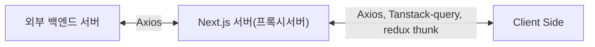

# ✨ Next.js 프로젝트

이 프로젝트는 [`create-next-app`](https://nextjs.org/docs/app/api-reference/cli/create-next-app)으로 생성된 [Next.js](https://nextjs.org) 애플리케이션입니다.

## 🛠️ 기술 스택

- pnpm
- Next.js
- TypeScript
- Tailwind CSS
- shadcn/ui
- redux
- tanstack query
- axios

## 🚀 개발 시작하기

다음 명령어로 개발 서버를 실행해 봅시다...

```bash
# 👇 pnpm 패키지 매니저를 사용해 주세요잉.
pnpm dev
# npm run dev
# yarn dev
# bun dev
```

`app/page.tsx` 파일을 수정하여 페이지 편집을 시작할 수 있습니다.

## 💎 주요 기능

이 프로젝트는 [`next/font`](https://nextjs.org/docs/app/building-your-application/optimizing/fonts)를 사용하여 [Geist](https://vercel.com/font) 폰트를 자동으로 최적화하고 로드합니다.
Geist는 Vercel의 새로운 폰트 패밀리입니다.

## 📚 더 알아보기

Next.js에 대해 더 알아보려면 다음 리소스를 참고하세요:

- [Next.js 문서](https://nextjs.org/docs) - Next.js의 기능과 API에 대해 알아보세요.
- [Next.js 배우기](https://nextjs.org/learn) - 인터랙티브 Next.js 튜토리얼을 경험해보세요.
- [Next.js GitHub 저장소](https://github.com/vercel/next.js)에서 더 많은 정보를 확인할 수 있습니다.

## 🪣 redux 관련 설정 설명

이 구조는 Redux Toolkit과 RTK Query의 공식 권장 사항을 따르는 "feature-first" 접근 방식으로, 관련 코드를 기능별로 그룹화하여 유지보수성을 높입니다.

```text
src/
  ├── lib/
  │   ├── config/
  │   │   ├── createAppSlice.ts     # Redux Thunk 관련 함수
  │   │   ├── ssrSafeStorage.ts     # SSR 환경에서 redux-persist 원활한 사용을 위한 유틸 함수
  │   │   └── store.ts              # Redux 스토어 설정
  │   └── features/                 # 기능별 Redux 로직
  │       ├── counter/              # 카운터 기능 관련 Redux 파일
  │       │   ├── counterAPI.ts     # 카운터 관련 비동기 액션
  │       │   └── counterSlice.ts   # 카운터 Slice
  │       ├── quotes/               # 인용구 기능 관련 Redux 파일
  │       │   └── quotesApiSlice.ts # RTK Query API Slice
  │       └── [feature-name]/       # 기타 기능 ( counter 참고하여 필요할 때마다 추가하세요잉 )
  │           ├── [feature]API.ts   # API 관련 로직
  │           └── [feature]Slice.ts # 각 기능의 Slice
  └── hooks/
      └── useReduxStore.ts       # useDispatch, useSelector 타입 훅
```

## 📁 라우팅 구조 설명 예시

### 일반 페이지 (routes)

/ → 홈페이지  
/about → 소개 페이지  
/products → 상품 목록  
/products/[id] → 상품 상세

### 인증 페이지 (auth)

/login → 로그인  
/register → 회원가입  
/forgot-password → 비밀번호 찾기  
/reset-password → 비밀번호 재설정

### 관리자 페이지 (admin)

/admin → 관리자 대시보드  
/admin/users → 사용자 관리  
/admin/settings → 환경설정  
/admin/products → 상품 관리

### 디렉토리 구조 예시

> **Note**: 괄호로 묶인 디렉토리명 `(routes)`, `(auth)`, `(admin)`은 코드 구성을 위한 것으로, 실제 URL에는 포함되지 않습니다. 각 페이지는 `page.tsx` 파일로 구현되며, 동적 라우팅은 `[paramName]` 형식을 사용합니다.

```text
src/app/
├── (routes)/            # 일반
│   ├── page.tsx         # 홈페이지
│   └── products/
│       ├── page.tsx     # 상품 목록 페이지
│       └── [id]/
│           └── page.tsx # 상품 상세 페이지
├── (auth)/              # 인증 관련
│   ├── login/
│   │   └── page.tsx     # 로그인 페이지
│   └── register/
│       └── page.tsx     # 회원가입 페이지
└── (admin)/             # 관리자 관련
    ├── page.tsx         # 관리자 메인 페이지
    └── users/
        └── page.tsx     # 관리자 사용자 관리 페이지
```

실제 접근 가능한 URL은:

```text
/                  -> 홈페이지
/products          -> 상품 목록 페이지
/products/123      -> ID가 123인 상품 상세 페이지
/login             -> 로그인 페이지
/register          -> 회원가입 페이지
/admin             -> 관리자 메인 페이지
/admin/users       -> 관리자 사용자 관리 페이지
```

## 🚥 Next.js 라우트 핸들러 (Route Handlers)

### 라우트 핸들러란?

라우트 핸들러는 Next.js에서 API 엔드포인트를 만들 수 있는 기능입니다. 웹 표준인 Request 및 Response API를 사용하여 특정 라우트에 대한 사용자 정의 요청 핸들러를 생성할 수 있습니다.

> 💡 라우트 핸들러는 App Router 내에서만 작동합니다. 이는 Pages Router의 API Routes를 대체하는 기능입니다..

### 기본 사용법

라우트 핸들러는 app 디렉토리 내에서 **route.js|ts** 파일에 정의됩니다. 하지만 page.js|ts 파일과 동일한 경로에는 사용할 수 없습니다.

```typescript
// app/api/route.ts
export async function GET() {
	return Response.json({ message: "안녕하세요!" });
}
```

라우트 핸들러는 다음과 같은 HTTP 메서드를 지원합니다:

- GET
- POST
- PUT
- PATCH
- DELETE
- HEAD
- OPTIONS

```typescript
// app/api/route.ts
export async function GET() {
	return new Response("GET 요청 처리");
}

export async function POST() {
	return new Response("POST 요청 처리");
}
```

또한, NextRequest와 NextResponse를 통해 확장된 기능을 사용할 수도 있습니다.

```typescript
// app/api/route.ts
import { NextResponse } from "next/server";

export async function GET() {
	return NextResponse.json({ message: "안녕하세요!" });
}
```

### 쿠키 처리하기

쿠키를 읽거나 설정하려면 next/headers에서 제공하는 cookies 함수를 사용할 수 있습니다.

```typescript
// app/api/route.ts
import { cookies } from "next/headers";

export async function GET(request: Request) {
	const cookieStore = await cookies();
	const token = cookieStore.get("token");

	return new Response("안녕하세요!", {
		status: 200,
		headers: { "Set-Cookie": `token=${token.value}` },
	});
}
```

또는 NextRequest API를 사용할 수도 있습니다.

```typescript
// app/api/route.ts
import { type NextRequest } from "next/server";

export async function GET(request: NextRequest) {
	const token = request.cookies.get("token");
	// 쿠키 활용하기
}
```

### 헤더 처리하기

헤더를 읽기 위해 next/headers에서 제공하는 headers 함수를 사용할 수 있습니다.

```typescript
// app/api/route.ts
import { headers } from "next/headers";

export async function GET(request: Request) {
	const headersList = await headers();
	const referer = headersList.get("referer");

	return new Response("안녕하세요!", {
		status: 200,
		headers: { referer: referer },
	});
}
```

NextRequest를 사용한 방법:

```typescript
// app/api/route.ts
import { type NextRequest } from "next/server";

export async function GET(request: NextRequest) {
	const requestHeaders = new Headers(request.headers);
	// 헤더 활용하기
}
```

### 리다이렉트

next/navigation의 redirect 함수를 사용하여 다른 URL로 리다이렉트할 수 있어습니다.

```typescript
// app/api/route.ts
import { redirect } from "next/navigation";

export async function GET(request: Request) {
	redirect("https://nextjs.org/");
}
```

### 동적 라우트 세그먼트

동적 데이터를 기반으로 요청 핸들러를 생성하기 위해 동적 세그먼트를 사용할 수 있습니다.

```typescript
// app/items/[slug]/route.ts
export async function GET(
	request: Request,
	{ params }: { params: Promise<{ slug: string }> },
) {
	const { slug } = await params; // 'a', 'b', 또는 'c' 등
	return Response.json({ slug });
}
```

| 라우트                    | 예시 URL | params                 |
| ------------------------- | -------- | ---------------------- |
| app/items/[slug]/route.js | /items/a | Promise<{ slug: 'a' }> |
| app/items/[slug]/route.js | /items/b | Promise<{ slug: 'b' }> |
| app/items/[slug]/route.js | /items/c | Promise<{ slug: 'c' }> |

### URL 쿼리 파라미터

NextRequest 인스턴스를 사용하면 쿼리 파라미터를 쉽게 처리할 수 있습니다.

```typescript
// app/api/search/route.ts
import { type NextRequest } from "next/server";

export function GET(request: NextRequest) {
	const searchParams = request.nextUrl.searchParams;
	const query = searchParams.get("query");
	// query는 /api/search?query=hello에서 "hello"

	return Response.json({ query });
}
```

### 스트리밍

스트리밍은 경로를 더 작은 "chunks"로 나누고 준비가 되면 서버에서 클라이언트로 점진적으로 스트리밍할 수 있는 데이터 전송 기술입니다.  
스트리밍하면 느린 데이터 요청이 전체 페이지를 차단하는 것을 방지할 수 있습니다. 이를 통해 사용자는 UI가 사용자에게 표시되기 전에 모든 데이터가 로드될 때까지 기다리지 않고 페이지의 일부를 보고 상호 작용할 수 있습니다.

```typescript
// app/api/chat/route.ts
import { openai } from "@ai-sdk/openai";
import { StreamingTextResponse, streamText } from "ai";

export async function POST(req: Request) {
	const { messages } = await req.json();
	const result = await streamText({
		model: openai("gpt-4-turbo"),
		messages,
	});

	return new StreamingTextResponse(result.toAIStream());
}
```

또는 웹 API를 직접 사용할 수도 있습니다.

```typescript
// app/api/route.ts
// 비동기 이터레이터를 스트림으로 변환
function iteratorToStream(iterator: any) {
	return new ReadableStream({
		async pull(controller) {
			const { value, done } = await iterator.next();

			if (done) {
				controller.close();
			} else {
				controller.enqueue(value);
			}
		},
	});
}

function sleep(time: number) {
	return new Promise((resolve) => {
		setTimeout(resolve, time);
	});
}

const encoder = new TextEncoder();

async function* makeIterator() {
	yield encoder.encode("<p>첫번째</p>");
	await sleep(200);
	yield encoder.encode("<p>두번째</p>");
	await sleep(200);
	yield encoder.encode("<p>세번째</p>");
}

export async function GET() {
	const iterator = makeIterator();
	const stream = iteratorToStream(iterator);

	return new Response(stream);
}
```

### 요청 본문 처리하기

표준 웹 API 메서드를 사용하여 요청 본문을 읽을 수 있습니다.

```typescript
// app/items/route.ts
export async function POST(request: Request) {
	const res = await request.json();
	return Response.json({ res });
}
```

#### FormData 처리하기

request.formData() 함수를 사용하여 FormData를 처리할 수 있습니다.

```typescript
// app/items/route.ts
export async function POST(request: Request) {
	const formData = await request.formData();
	const name = formData.get("name");
	const email = formData.get("email");
	return Response.json({ name, email });
}
```

> 💡 FormData의 모든 데이터는 문자열이므로, 다른 형식(예: 숫자)으로 데이터를 가져오려면 zod-form-data 같은 라이브러리를 사용하는 것이 좋습니다...

### CORS 설정하기

특정 라우트 핸들러에 CORS 헤더를 설정할 수 있습니다.......

```typescript
// app/api/route.ts
export async function GET(request: Request) {
	return new Response("안녕하세요!", {
		status: 200,
		headers: {
			"Access-Control-Allow-Origin": "*",
			"Access-Control-Allow-Methods": "GET, POST, PUT, DELETE, OPTIONS",
			"Access-Control-Allow-Headers": "Content-Type, Authorization",
		},
	});
}
```

> 참고: 여러 라우트 핸들러에 CORS 헤더를 추가하려면 미들웨어나 next.config.ts|js 파일을 사용할 수 있습니다

### 웹훅 처리하기

서드파티 서비스의 웹훅을 받기 위해 라우트 핸들러를 사용할 수 있습니다

```typescript
// app/api/route.ts
export async function POST(request: Request) {
	try {
		const text = await request.text();
		// 웹훅 페이로드 처리하기
	} catch (error) {
		return new Response(`웹훅 오류: ${error.message}`, {
			status: 400,
		});
	}

	return new Response("성공!", {
		status: 200,
	});
}
```

Pages Router의 API Routes와 달리 추가 설정 없이 바로 사용 가능합니다.

### UI가 아닌 응답

UI가 아닌 콘텐츠를 반환하기 위해 라우트 핸들러를 사용할 수 있습니다. (sitemap.xml, robots.txt, 앱 아이콘, 오픈 그래프 이미지는 모두 기본 지원)

```typescript
// app/rss.xml/route.ts
export async function GET() {
	return new Response(
		`<?xml version="1.0" encoding="UTF-8" ?>
		<rss version="2.0">
			<channel>
				<title>Next.js 문서</title>
				<link>https://nextjs.org/docs</link>
				<description>웹을 위한 React 프레임워크</description>
			</channel>
		</rss>`,
		{
			headers: {
				"Content-Type": "text/xml",
			},
		},
	);
}
```

### 세그먼트 설정 옵션

라우트 핸들러는 페이지와 레이아웃과 동일한 라우트 세그먼트 설정을 사용합니다

```typescript
// app/items/route.ts
export const dynamic = "auto";
export const dynamicParams = true;
export const revalidate = false;
export const fetchCache = "auto";
export const runtime = "nodejs";
export const preferredRegion = "auto";
```

자세한 내용은 [API 참조](https://nextjs.org/docs/app/building-your-application/routing/route-handlers#api-reference)를 확인해 주세요..

## 🤷‍♂️ Next.js에서 tanstack-query가 필요할까요?

Next.js의 App Router와 React Server Components(RSC)의 등장으로 데이터 페칭에 대한 접근 방식이 크게 변화하였습니다. 이는 tanstack-query(이전의 react-query)의 필요성에 대한 질문을 불러일으킵니다.

### Next.js의 내장 데이터 페칭 기능

Next.js는 확장된 fetch 함수를 통해 다음과 같은 강력한 기능을 제공합니다

- 자동 요청 중복 제거
- 자동 캐싱 메커니즘
- revalidate 기능을 통한 데이터 갱신
  이러한 기능들은 tanstack-query가 제공하는 많은 기능과 유사합니다.

```typescript
// Next.js의 서버 컴포넌트에서 데이터 페칭 예시
async function getData() {
  const res = await fetch('https://api.example.com/...', { next: { revalidate: 10 } });
  // 아래처럼 캐싱도 가능하다
  // fetch(`https://...`, { cache: 'no-store' })
  // fetch('https://...', { cache: 'force-cache' })

  if (!res.ok) {
    throw new Error('Failed to fetch data');
  }

  return res.json();
}

export default async function Page() {
  const data = await getData();
  return <main>{/* 데이터 렌더링 */}</main>;
}
```

### 그럼에도 tanstack-query가 여전히 유용한 경우

하지만 tanstack-query는 다음과 같은 상황에서 여전히 가치가 있습니다

1. **클라이언트 컴포넌트에서의 데이터 페칭**: 서버 컴포넌트만으로 모든 데이터 요구사항을 처리할 수 없는 경우가 있습니다.
2. **복잡한 상태 관리**: 로딩, 에러, 성공 상태를 세밀하게 제어해야 하는 경우
3. **낙관적 업데이트**: 사용자 경험을 개선하기 위한 낙관적 UI 업데이트 기능
4. **의존성 쿼리**: 이전 쿼리 결과에 따라 다음 쿼리가 달라지는 복잡한 데이터 패칭 시나리오
5. **무한 스크롤/페이지네이션**: 이러한 UI 패턴을 구현할 때 tanstack-query의 유틸리티가 유용합니다.
6. **강력한 캐시 무효화와 리페칭**: 특정 조건에 따른 세밀한 캐시 제어가 필요할 때

### 결론

Next.js의 내장 데이터 페칭 메커니즘만으로도 많은 사용 사례에 충분하지만, tanstack-query는 복잡한 클라이언트 사이드 데이터 상호작용이 필요한 애플리케이션에서 여전히 가치가 있습니다. 현재의 과도기적 시점에서 tanstack-query는 서버 컴포넌트가 아직 완벽하게 지원하지 못하는 사용 사례를 위한 통합 솔루션으로 역할을 할 수 있습니다.
프로젝트의 요구사항과 복잡성에 따라 두 접근 방식을 적절히 조합하는 것이 최선의 전략일 수 있습니다. 간단한 데이터 페칭은 Next.js의 내장 기능을 활용하고, 복잡한 클라이언트 상호작용이 필요한 부분에서는 tanstack-query를 사용하는 하이브리드 접근법을 고려해보는 것이 적절해 보입니다..

## 🏗 Next.js 라우트 핸들러를 활용하여 백엔드 프록시 아키텍처 구현하기

Next.js 프레임워크를 사용하여 프로젝트를 만들면서...
프론트 영역은 데이터 상태 관리의 역할을 하고 단순히 화면 구성 & 백엔드 요청의 역할만 하고
Next.js 서버 영역은 백엔드 프록시 역할을 수행할 수 있도록 구성하고자 하였습니다.
아래는 해당 내용(백엔드 프록시 아키텍처)에 대한 예시입니다.



### 핵심 장점

이 아키텍처의 주요 이점은 다음과 같습니다

- 보안 강화: 직접적인 API 엔드포인트를 클라이언트에 노출하지 않음
- 인증 중앙화: 토큰 관리를 Next.js 서버에서 처리
- 데이터 변환: 필요한 경우 백엔드 응답을 클라이언트에 맞게 변환
- 캐싱 활용: Next.js의 캐싱 기능을 활용할 수 있음
- CORS 이슈 방지: 모든 API 요청이 동일 출처에서 발생
  이 구조는 Next.js의 Route Handlers를 활용하여 효과적인 백엔드 프록시를 구현하며, 프론트엔드와 백엔드 간의 관심사를 명확하게 분리합니다.

### Next.js의 Route Handlers 활용 예시

#### 1. 기본 구조 설정

API 요청을 처리할 Route Handler 구조 생성

```typescript
// app/api/[...path]/route.ts
import { NextRequest, NextResponse } from "next/server";

// Spring Boot API의 기본 URL
const API_BASE_URL = process.env.API_BASE_URL || "http://localhost:8080/api";

export async function GET(
	request: NextRequest,
	{ params }: { params: { path: string[] } },
) {
	const path = params.path.join("/");
	const url = new URL(request.url);
	const queryString = url.search;

	try {
		const response = await fetch(`${API_BASE_URL}/${path}${queryString}`, {
			headers: {
				"Content-Type": "application/json",
				// 필요한 경우 인증 토큰 등을 전달
				...getAuthHeaders(request),
			},
		});

		const data = await response.json();
		return NextResponse.json(data);
	} catch (error) {
		console.error("API 요청 오류:", error);
		return NextResponse.json(
			{ error: "서버 오류가 발생했습니다." },
			{ status: 500 },
		);
	}
}

export async function POST(
	request: NextRequest,
	{ params }: { params: { path: string[] } },
) {
	const path = params.path.join("/");
	const body = await request.json();

	try {
		const response = await fetch(`${API_BASE_URL}/${path}`, {
			method: "POST",
			headers: {
				"Content-Type": "application/json",
				...getAuthHeaders(request),
			},
			body: JSON.stringify(body),
		});

		const data = await response.json();
		return NextResponse.json(data);
	} catch (error) {
		console.error("API 요청 오류:", error);
		return NextResponse.json(
			{ error: "서버 오류가 발생했습니다." },
			{ status: 500 },
		);
	}
}

// PUT, PATCH, DELETE 등의 다른 HTTP 메서드도 유사하게 구현

// 요청에서 인증 정보를 추출하는 헬퍼 함수
function getAuthHeaders(request: NextRequest) {
	const authHeader = request.headers.get("authorization");
	return authHeader ? { Authorization: authHeader } : {};
}
```

#### 2. 특정 API 엔드포인트 구현

```typescript
// app/api/users/route.ts
import { NextRequest, NextResponse } from "next/server";

const API_BASE_URL = process.env.API_BASE_URL || "http://localhost:8080/api";

export async function GET(request: NextRequest) {
	try {
		const response = await fetch(`${API_BASE_URL}/users`, {
			headers: {
				"Content-Type": "application/json",
				...getAuthHeaders(request),
			},
		});

		const users = await response.json();

		// 필요한 경우 데이터 변환 작업 수행
		const transformedUsers = users.map((user) => ({
			id: user.id,
			name: user.name,
			email: user.email,
			// 민감한 정보 제거 또는 필요한 정보만 선택
		}));

		return NextResponse.json(transformedUsers);
	} catch (error) {
		console.error("사용자 데이터 요청 오류:", error);
		return NextResponse.json(
			{ error: "사용자 데이터를 불러오는 중 오류가 발생했습니다." },
			{ status: 500 },
		);
	}
}

// 기타 함수들...
```

#### 3. 프론트엔드에서 API 호출하기

프론트엔드 코드에서는 Next.js 서버의 API 엔드포인트만 호출하면 됩니다

```typescript
// 클라이언트 컴포넌트에서 사용
'use client';

import { useState, useEffect } from 'react';

export default function UserList() {
  const [users, setUsers] = useState([]);
  const [loading, setLoading] = useState(true);
  const [error, setError] = useState(null);

  useEffect(() => {
    const fetchUsers = async () => {
      try {
        // Next.js 백엔드 서버로 요청
        const response = await fetch('/api/users');

        if (!response.ok) {
          throw new Error('서버 오류가 발생했습니다.');
        }

        const data = await response.json();
        setUsers(data);
      } catch (err) {
        setError(err.message);
      } finally {
        setLoading(false);
      }
    };

    fetchUsers();
  }, []);

  if (loading) return <div>로딩 중...</div>;
  if (error) return <div>오류: {error}</div>;

  return (
    <div>
      <h1>사용자 목록</h1>
      <ul>
        {users.map(user => (
          <li key={user.id}>{user.name} ({user.email})</li>
        ))}
      </ul>
    </div>
  );
}
```

#### 4. API 클라이언트 유틸리티 ( 선택 사항 )

반복되는 API 호출 로직을 단순화하기 위한 유틸리티 함수를 만들 수 있습니다

```typescript
// lib/apiClient.ts
type HttpMethod = "GET" | "POST" | "PUT" | "PATCH" | "DELETE";

interface RequestOptions {
	method?: HttpMethod;
	body?: any;
	headers?: Record<string, string>;
}

export async function apiClient<T>(
	endpoint: string,
	options: RequestOptions = {},
): Promise<T> {
	const { method = "GET", body, headers = {} } = options;

	const config: RequestInit = {
		method,
		headers: {
			"Content-Type": "application/json",
			...headers,
		},
	};

	if (body) {
		config.body = JSON.stringify(body);
	}

	try {
		const response = await fetch(`/api/${endpoint}`, config);

		if (!response.ok) {
			// 에러 응답 처리
			const errorData = await response.json().catch(() => null);
			throw new Error(errorData?.error || `API 요청 실패: ${response.status}`);
		}

		return await response.json();
	} catch (error) {
		console.error(`API 요청 오류 (${endpoint}):`, error);
		throw error;
	}
}
```

이 유틸리티를 사용한 컴포넌트 예시

```typescript
"use client";

import { useState, useEffect } from "react";
import { apiClient } from "@/lib/apiClient";

export default function ProductList() {
	const [products, setProducts] = useState([]);
	const [loading, setLoading] = useState(true);
	const [error, setError] = useState(null);

	useEffect(() => {
		const fetchProducts = async () => {
			try {
				// 유틸리티 함수 사용
				const data = await apiClient("products");
				setProducts(data);
			} catch (err) {
				setError(err.message);
			} finally {
				setLoading(false);
			}
		};

		fetchProducts();
	}, []);

	// UI 렌더링 코드...
}
```

#### 5. 인증 처리 예시

토큰 기반 인증의 경우..

```typescript
// app/api/auth/login/route.ts
import { NextRequest, NextResponse } from "next/server";
import { cookies } from "next/headers";

const API_BASE_URL = process.env.API_BASE_URL || "http://localhost:8080/api";

export async function POST(request: NextRequest) {
	try {
		const { username, password } = await request.json();

		const response = await fetch(`${API_BASE_URL}/auth/login`, {
			method: "POST",
			headers: {
				"Content-Type": "application/json",
			},
			body: JSON.stringify({ username, password }),
		});

		const data = await response.json();

		if (!response.ok) {
			return NextResponse.json(
				{ error: data.message || "로그인 실패" },
				{ status: response.status },
			);
		}

		// 토큰을 쿠키에 저장
		const cookieStore = cookies();
		cookieStore.set("auth-token", data.token, {
			httpOnly: true,
			secure: process.env.NODE_ENV === "production",
			maxAge: 60 * 60 * 24 * 7, // 1주일
			path: "/",
		});

		return NextResponse.json({ success: true });
	} catch (error) {
		console.error("로그인 오류:", error);

		if (error.response) {
			return NextResponse.json(
				{
					error: error.response.data?.message || "인증 실패",
				},
				{ status: error.response.status },
			);
		}

		return NextResponse.json(
			{ error: "서버 연결 오류가 발생했습니다." },
			{ status: 500 },
		);
	}
}
```

##### 인증 쿠키 전달 설정

모든 API 요청에 인증 토큰을 함께 전달하려면 백엔드 API 클라이언트를 수정합니다

```typescript
// lib/server/api.ts
import axios from "axios";
import { cookies } from "next/headers";

// 서버 사이드에서만 사용되는 Axios 인스턴스
const createServerAPI = () => {
	const api = axios.create({
		baseURL: process.env.API_BASE_URL || "http://localhost:8080/api",
		timeout: 10000,
		headers: {
			"Content-Type": "application/json",
		},
	});
	api.interceptors.request.use(async (config) => {
		const cookieStore = await cookies();
		const token = cookieStore.get("auth-token");

		if (token) {
			config.headers["Authorization"] = `Bearer ${token.value}`;
		}

		return config;
	});

	return api;
};

// 서버 API 인스턴스 생성
const serverAPI = createServerAPI();

export default serverAPI;
```

## 📦 스토리지 관련 유틸리티 훅

### 쿠키 (Cookies)

/hooks/useCookie.ts
쿠키는 클라이언트와 서버 간에 데이터를 공유할 수 있는 작은 텍스트 파일입니다. 이 프로젝트는 쿠키를 안전하게 다루기 위한 암호화된 유틸리티 함수를 제공합니다.

#### 특징

- 서버 컴포넌트와 클라이언트 컴포넌트 모두에서 사용 가능
- 자동 암호화/복호화 처리
- 다양한 쿠키 옵션 지원 (만료, 도메인, 경로 등)

#### 주요 함수

```typescript
// 쿠키 값 가져오기
await getCookie(name: string): Promise<string | undefined>

// 모든 쿠키 가져오기
await getAllCookies(): Promise<{ name: string; value: string }[]>

// 쿠키 존재 여부 확인
await checkCookie(name: string): Promise<boolean>

// 쿠키 설정하기
await setCookie(name: string, value: string, options?: CookieOptions): Promise<void>

// 쿠키 삭제하기
await deleteCookie(name: string): Promise<void>
```

### 로컬 스토리지 (LocalStorage)

/hooks/useLocalStorage.ts
로컬 스토리지는 브라우저에 데이터를 영구적으로 저장할 수 있는 웹 스토리지 메커니즘입니다. 브라우저를 닫고 다시 열어도 데이터가 유지됩니다.

#### 특징

- 클라이언트 사이드 전용
- 암호화 기반 데이터 보안
- 간편한 API

#### 주요 함수

```typescript
// 항목 가져오기
getLocalStorageItem(key: string): string | undefined

// 모든 항목 가져오기
getLocalStorageAllItems(): { key: string; value: string }[]

// 항목 설정하기
setLocalStorageItem(key: string, value: string): void

// 항목 존재 여부 확인
checkLocalStorageItem(key: string): boolean

// 항목 삭제하기
deleteLocalStorageItem(key: string): void
```

### 세션 스토리지 (SessionStorage)

/hooks/useSessionStorage.ts
세션 스토리지는 브라우저 세션 동안만 데이터를 저장하는 웹 스토리지 메커니즘입니다. 브라우저 탭이나 창을 닫으면 데이터가 삭제됩니다

#### 특징

- 클라이언트 사이드 전용
- 세션(탭)이 종료되면 데이터 삭제
- 로컬 스토리지와 동일한 API 패턴

#### 주요 함수

```typescript
// 항목 가져오기
getSessionStorageItem(key: string): string | undefined

// 모든 항목 가져오기
getSessionStorageAllItems(): { key: string; value: string }[]

// 항목 설정하기
setSessionStorageItem(key: string, value: string): void

// 항목 존재 여부 확인
checkSessionStorageItem(key: string): boolean

// 항목 삭제하기
deleteSessionStorageItem(key: string): void
```

### Redux 지속성

설정 경로: /lib/config/store.ts의 persistConfig 참고

#### 특징

- redux devtools는 운영환경에서 비활성화 됨
- redux-persist에 의해서 브라우저 로컬 스토리지(혹은 세션 스토리지)에 redux 상태가 저장되는데 이 역시 암호화/복호화 처리를 하였음

### 사용 예시

#### 쿠키 사용 예시

```typescript
import { setCookie, getCookie, deleteCookie } from "@/hooks/useCookie";

// 쿠키 설정
await setCookie("username", "홍길동", { maxAge: 3600, path: "/" });

// 쿠키 가져오기
const username = await getCookie("username");
console.log(username); // '홍길동'

// 쿠키 삭제
await deleteCookie("username");
```

#### 로컬 스토리지 사용 예시

```typescript
import {
	setLocalStorageItem,
	getLocalStorageItem,
} from "@/hooks/useLocalStorage";

// 로컬 스토리지에 데이터 저장
setLocalStorageItem(
	"user-preferences",
	JSON.stringify({ theme: "dark", fontSize: 16 }),
);

// 로컬 스토리지에서 데이터 가져오기
const preferencesStr = getLocalStorageItem("user-preferences");
const preferences = preferencesStr ? JSON.parse(preferencesStr) : null;
console.log(preferences); // { theme: 'dark', fontSize: 16 }
```

#### 세션 스토리지 사용 예시

```typescript
import {
	setSessionStorageItem,
	getSessionStorageItem,
} from "@/hooks/useSessionStorage";

// 세션 스토리지에 데이터 저장
setSessionStorageItem("current-search", "검색어");

// 세션 스토리지에서 데이터 가져오기
const searchTerm = getSessionStorageItem("current-search");
console.log(searchTerm); // '검색어'
```

모든 스토리지 관련 유틸리티는 보안을 강화하기 위해 암호화를 사용합니다. 민감한 데이터를 저장할 때 이러한 유틸리티를 사용하면 일반 텍스트 노출 위험을 줄일 수 있습니다.
더 자세한 사용 예시는 /app/(routes)/example/storage/page.tsx를 참조하세요.

## 🌟 Next.js Loading UI & Streaming

Next.js >=15은 React Suspense를 활용한 로딩 UI와 스트리밍 기능을 제공합니다. 이 프로젝트에서도 사용자 경험을 향상시키기 위해 다음과 같은 방식으로 구현하였습니다.

- 점진적 페이지 로딩: 전체 페이지가 준비될 때까지 기다리지 않고, 준비된 부분부터 사용자에게 표시합니다.
- 스켈레톤 UI: 데이터가 로드되는 동안 컴포넌트의 형태를 미리 보여주는 스켈레톤을 표시합니다.
- 컴포넌트별 독립적 로딩 상태: 각 컴포넌트는 개별적으로 로딩 상태를 가질 수 있어 페이지의 다른 부분이 차단되지 않습니다.

### 사용방법

1. Suspense와 fallback UI 사용하기

```tsx
import { Suspense } from "react";

// 로딩 중에 표시할 Fallback 컴포넌트
function ComponentFallback() {
	return (
		<div className="w-full space-y-3">
			<Skeleton className="h-6 w-40" />
			<Skeleton className="h-20 w-full rounded-md" />
		</div>
	);
}

// 컴포넌트에서 사용
<Suspense fallback={<ComponentFallback />}>
	<DataFetchingComponent />
</Suspense>;
```

2. 개발 환경에서 로딩 상태 시뮬레이션 (테스트 해보기)

```tsx
// 비동기 컴포넌트로 래핑하여 로딩 시간 시뮬레이션
<Suspense fallback={<ComponentFallback />}>
	<AsyncComponent name="chart" delayMs={1000}>
		<MyComponent />
	</AsyncComponent>
</Suspense>
```

3. loading.tsx 파일 사용하기
   특정 라우트에 대한 로딩 UI를 제공하려면 해당 폴더에 loading.tsx 파일을 생성하세요. 이 파일은 해당 라우트가 로드되는 동안 자동으로 표시됩니다.

### 최적화 팁

- 우선순위 고려: 중요한 콘텐츠를 먼저 로드하고, 덜 중요한 콘텐츠는 나중에 로드되도록 설계하세요.
- 스켈레톤 정교화: 실제 컴포넌트와 유사한 형태의 스켈레톤을 사용하면 더 자연스러운 전환 경험을 제공할 수 있습니다.
- 적절한 시간 설정: 개발 환경에서는 AsyncComponent의 delayMs 값을 조정하여 다양한 네트워크 조건을 시뮬레이션해 볼 수 있습니다.
  이 기능들을 활용하면 초기 페이지 로딩 시간을 줄이고, 사용자에게 더 반응성 높은 웹 애플리케이션을 제공할 수 있습니다.

## 📝 배포 전략

### 1. 서버 초기 설정

```bash
# 서버 패키지 업데이트
sudo apt-get update && sudo apt-get upgrade -y

# Node.js 설치 (22.x)
curl -fsSL https://deb.nodesource.com/setup_22.x | sudo -E bash -
sudo apt-get install -y nodejs

# 필요한 툴 설치
sudo apt-get install -y git rsync

# pnpm 설치
npm install -g pnpm

# PM2 설치
sudo npm install -g pm2

# PM2 시작 시 자동 실행 설정
pm2 startup

# 애플리케이션 디렉토리 생성
mkdir -p ~/nextjs-app

# Install dependencies and restart service step을 위해
# 심볼릭 링크 걸어주기
which node
sudo ln -s /opt/nodejs/node/bin/node /usr/local/bin/node
which pnpm
sudo ln -s /opt/nodejs/node/bin/pnpm /usr/local/bin/pnpm
which pm2
sudo ln -s /opt/nodejs/node/bin/pm2 /usr/local/bin/pm2
```

### 2. Nginx 웹 서버 설정

```bash
# Nginx 설치
sudo apt-get update
sudo apt-get install -y nginx
```

```text
# /etc/nginx/sites-available/default
server {
	listen 80;
	listen [::]:80;
    server_name your-domain.com; # dev-seodalgo.kro.kr

    location ^~ /next {
        proxy_pass http://localhost:4010;
        proxy_http_version 1.1;
        proxy_set_header Upgrade $http_upgrade;
        proxy_set_header Connection 'upgrade';
        proxy_set_header Host $host;
        proxy_cache_bypass $http_upgrade;
        proxy_set_header X-Real-IP $remote_addr;
        proxy_set_header X-Forwarded-For $proxy_add_x_forwarded_for;
        proxy_set_header X-Forwarded-Proto $scheme;
    }

	# Next.js 정적 파일 처리
	location ^~ /next/_next/static/ {
		proxy_pass http://localhost:4010/_next/static/;
		proxy_cache_valid 200 302 60m;
		proxy_cache_valid 404 1m;
		expires 1y;
		add_header Cache-Control "public, max-age=31536000, immutable";
	}
}
```

```bash
# 문법 검사
sudo nginx -t

# Nginx 재시작
sudo systemctl restart nginx

# 방화벽 설정 (선택사항)
sudo ufw allow 'Nginx Full'
```

### 3. PM2 설정

```javascript
// PM2 설정 파일
module.exports = {
	apps: [
		{
			name: "nextjs-app", // 애플리케이션 이름
			script: "node_modules/next/dist/bin/next", // 실행할 스크립트
			args: "start --port 4010", // 실행할 스크립트 인수
			instances: "max", // 동시에 실행할 인스턴스 수 (이 경우, 서버의 코어 개수만큼)
			exec_mode: "cluster",
			autorestart: true, // 프로세스가 비정상적으로 종료될 때 자동으로 다시 시작
			watch: false, // 파일 변경 감지
			max_memory_restart: "1G", // 메모리 임계값을 설정하여 재시작
			wait_ready: true, // Node.js 앱으로부터 앱이 실행되었다는 신호를 직접 받겠다는 의미
			listen_timeout: 50000, // 앱 실행 신호까지 기다릴 최대 시간. ms 단위.
			kill_timeout: 5000, // 새로운 프로세스 실행이 완료된 후 예전 프로세스를 교체하기까지 기다릴 시간
			time: true, // pm2 log 에서 콘솔들의 입력 시간이 언제인지 확인 가능
			// 실행 환경 변수 설정
			env: {
				NODE_ENV: "development",
				PORT: 4010,
			},
			env_production: {
				NODE_ENV: "production",
				PORT: 4010,
			},
		},
	],
};
```

### 4. 환경 변수 설정

.env.dev 파일 등..

> 브라우저에서 사용할 변수는 NEXT_PUBLIC\_ 접두사 사용해야 함을 주의

### 5. Github Actions 워크플로우 설정

```yaml
name: deploy-dev

on:
  push:
    branches:
      - deploy-dev

jobs:
  build-and-deploy:
    runs-on: ubuntu-latest
    env:
      SSH_KEY: ${{ secrets.DEV_SSH_KEY }}
      HOST: ${{ secrets.DEV_HOST }}
      USER: ${{ secrets.DEV_USER }}
      DIR: ${{ secrets.DEV_NEXT_APP_DIR }} # /home/ubuntu/디렉토리명

    steps:
      - name: Checking directory in instance
        uses: appleboy/ssh-action@master
        with:
          key: ${{ secrets.DEV_SSH_KEY }}
          host: ${{ secrets.DEV_HOST }}
          username: ${{ secrets.DEV_USER }}
          envs: DIR
          script: |
            [ -d "$DIR" ] && echo "directory exists" || mkdir -p "$DIR"

      - name: Checkout
        uses: actions/checkout@v4

      - name: Use Node.js 22
        uses: actions/setup-node@v4
        with:
          node-version: "22.1.0"

      - name: Use pnpm
        uses: pnpm/action-setup@v3
        with:
          version: 10.5.2
          run_install: false

      - name: Get pnpm store directory
        shell: bash
        run: |
          echo "STORE_PATH=$(pnpm store path --silent)" >> $GITHUB_ENV

      - name: Setup pnpm cache
        uses: actions/cache@v4
        with:
          path: ${{ env.STORE_PATH }}
          key: ${{ runner.os }}-pnpm-store-${{ hashFiles('**/pnpm-lock.yaml') }}
          restore-keys: |
            ${{ runner.os }}-pnpm-store-

      - name: Build Next.js app
        run: |
          pnpm install --no-frozen-lockfile
          cp .env.dev .env
          pnpm build

      - name: Prepare deployment
        run: |
          # 필요한 파일만 복사하기
          mkdir -p deployment
          cp -r .next deployment/
          cp -r public deployment/
          cp package.json pnpm-lock.yaml ecosystem.config.js deployment/
          cp .env.dev deployment/.env

      - name: Setup SSH
        run: |
          mkdir ~/.ssh
          echo "$SSH_KEY" >> ~/.ssh/github-action
          chmod 400 ~/.ssh/github-action
          echo -e "Host github-actions\n\tUser "$USER"\n\tHostname "$HOST"\n\tIdentityFile ~/.ssh/github-action\n\tStrictHostKeyChecking No" >> ~/.ssh/config

      - name: Deploy to server
        run: |
          rsync -avzr --delete deployment/ github-actions:"$DIR"/

      - name: Install dependencies and restart service
        uses: appleboy/ssh-action@master
        with:
          key: ${{ secrets.DEV_SSH_KEY }}
          host: ${{ secrets.DEV_HOST }}
          username: ${{ secrets.DEV_USER }}
          envs: DIR
          script: |
            cd "$DIR"
            pnpm install --production
            pm2 reload ecosystem.config.js --env development || pm2 start ecosystem.config.js --env development
```
