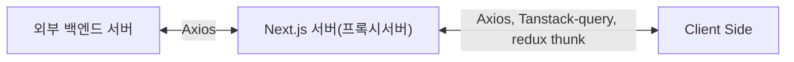

# ✨ Next.js 프로젝트

이 프로젝트는 [`create-next-app`](https://nextjs.org/docs/app/api-reference/cli/create-next-app)으로 생성된 [Next.js](https://nextjs.org) 애플리케이션입니다.

## 🚀 개발 시작하기

다음 명령어로 개발 서버를 실행해 봅시다...

```bash
# 👇 pnpm 패키지 매니저를 사용해 주세요잉.
pnpm dev
# npm run dev
# yarn dev
# bun dev
```

`app/page.tsx` 파일을 수정하여 페이지 편집을 시작할 수 있습니다.

## 💎 주요 기능

이 프로젝트는 [`next/font`](https://nextjs.org/docs/app/building-your-application/optimizing/fonts)를 사용하여 [Geist](https://vercel.com/font) 폰트를 자동으로 최적화하고 로드합니다. Geist는 Vercel의 새로운 폰트 패밀리입니다.

## 📚 더 알아보기

Next.js에 대해 더 알아보려면 다음 리소스를 참고하세요:

- [Next.js 문서](https://nextjs.org/docs) - Next.js의 기능과 API에 대해 알아보세요.
- [Next.js 배우기](https://nextjs.org/learn) - 인터랙티브 Next.js 튜토리얼을 경험해보세요.
- [Next.js GitHub 저장소](https://github.com/vercel/next.js)에서 더 많은 정보를 확인할 수 있습니다.

## 🛠️ 기술 스택

- Next.js
- TypeScript
- Tailwind CSS
- shadcn/ui
- pnpm
- redux

## redux 관련 설정 설명

이 구조는 Redux Toolkit과 RTK Query의 공식 권장 사항을 따르는 "feature-first" 접근 방식으로, 관련 코드를 기능별로 그룹화하여 유지보수성을 높입니다.

```text
lib/
  ├── store.ts                  # Redux 스토어 설정
  ├── features/                 # 기능별 Redux 로직
  │   ├── counter/              # 카운터 기능 관련 Redux 파일
  │   │   ├── counterApi.ts     # 카운터 관련 비동기 액션
  │   │   └── counterSlice.ts   # 카운터 Slice
  │   ├── quotes/               # 인용구 기능 관련 Redux 파일
  │   │   └── quotesApiSlice.ts # RTK Query API Slice
  │   └── [feature-name]/       # 기타 기능 ( counter 참고하여 필요할 때마다 추가하세요잉 )
  │       ├── [feature]Api.ts   # API 관련 로직
  │       └── [feature]Slice.ts # 각 기능의 Slice
  └── hooks.ts                  # useDispatch, useSelector 타입 훅
```

### 주요 컴포넌트 및 기능 설명

#### StoreProvider

Redux 스토어를 전체 애플리케이션에 제공하는 컴포넌트입니다. 다음과 같은 역할을 합니다:

- Next.js 앱 전체에 Redux 상태를 제공합니다
- 앱 초기 렌더링 시 스토어 인스턴스를 생성합니다
- RTK Query의 자동 리페치(refetch) 기능을 설정합니다

```tsx
// app/providers/StoreProvider.tsx
"use client";

export const StoreProvider = ({ children }: Props) => {
	// 스토어 생성 및 설정
	return <Provider store={storeRef.current}>{children}</Provider>;
};
```

#### Counter

기본적인 Redux 상태 관리를 보여주는 예시

- counterSlice를 통한 상태 정의 및 액션 생성
- 증가, 감소 및 리셋 기능 구현
- 페이지 이동 간 상태 유지 확인

```tsx
// components/counter/Counter.tsx에서 사용 예시
"use client";
import { useAppDispatch, useAppSelector } from "@/lib/hooks";
import {
	decrement,
	increment,
	reset,
} from "@/lib/features/counter/counterSlice";

export const Counter = () => {
	const count = useAppSelector((state) => state.counter.value);
	const dispatch = useAppDispatch();

	// 상태 업데이트 로직
};
```

#### Quotes 기능

RTK Query를 활용한 비동기 데이터 요청 예제입니다:

- quotesApiSlice를 통해 API 엔드포인트 정의
- 자동 로딩, 오류 상태 처리
- 데이터 캐싱 및 자동 refetch 기능

```tsx
// components/quotes/Quotes.tsx에서 사용 예시
"use client";
import { useGetQuotesQuery } from "@/lib/features/quotes/quotesApiSlice";

export const Quotes = () => {
	// 쿼리 훅을 사용하면 자동으로 데이터를 가져오고 쿼리 값을 반환합니다
	const { data, isError, isLoading, isSuccess } =
		useGetQuotesQuery(numberOfQuotes);

	// 데이터 표시 로직
};
```

#### Verify 페이지

Redux 상태가 페이지 네비게이션 사이에서 유지되는지 확인하는 페이지입니다:

- 카운터 상태가 다른 페이지로 이동 후에도 유지되는지 확인
- Next.js의 App Router에서 Redux가 올바르게 작동하는지 검증

```tsx
// app/verify/page.tsx
export default function VerifyPage() {
	return (
		<>
			<h1>확인 페이지</h1>
			<p>
				이 페이지는 Redux 상태가 페이지 이동 사이에서도 유지되는지 확인하기 위한
				페이지입니다.
			</p>
			{/* 여기서 카운터 컴포넌트를 사용하여 상태 유지 확인 */}
		</>
	);
}
```

## 📁 라우팅 구조 설명 예시

### 🌐 일반 페이지 (routes)

/ → 홈페이지
/about → 소개 페이지
/products → 상품 목록
/products/[id] → 상품 상세

### 🔐 인증 페이지 (auth)

/login → 로그인
/register → 회원가입
/forgot-password → 비밀번호 찾기
/reset-password → 비밀번호 재설정

### ⚙️ 관리자 페이지 (admin)

/admin → 관리자 대시보드
/admin/users → 사용자 관리
/admin/settings → 환경설정
/admin/products → 상품 관리

### 📂 디렉토리 구조 예시

> **Note**: 괄호로 묶인 디렉토리명 `(routes)`, `(auth)`, `(admin)`은 코드 구성을 위한 것으로, 실제 URL에는 포함되지 않습니다. 각 페이지는 `page.tsx` 파일로 구현되며, 동적 라우팅은 `[paramName]` 형식을 사용합니다.

```text
src/app/
├── (routes)/  # 일반 페이지
│   ├── page.tsx  # 홈페이지
│   └── products/
│       ├── page.tsx # 상품 목록
│       └── [id]/
│           └── page.tsx # 상품 상세
├── (auth)/ # 인증 관련
│   ├── login/
│   │   └── page.tsx
│   └── register/
│       └── page.tsx
└── (admin)/ # 관리자 페이지
    ├── page.tsx
    └── users/
        └── page.tsx
```

실제 접근 가능한 URL은:

```text
/                  -> 홈페이지
/products          -> 상품 목록 페이지
/products/123      -> ID가 123인 상품 상세 페이지
/login             -> 로그인 페이지
/register          -> 회원가입 페이지
/admin             -> 관리자 메인 페이지
/admin/users       -> 관리자 사용자 관리 페이지
```

## Next.js 라우트 핸들러 (Route Handlers)

### 라우트 핸들러란?

라우트 핸들러는 Next.js에서 API 엔드포인트를 만들 수 있는 기능입니다. 웹 표준인 Request 및 Response API를 사용하여 특정 라우트에 대한 사용자 정의 요청 핸들러를 생성할 수 있습니다.

> 💡 라우트 핸들러는 App Router 내에서만 작동합니다. 이는 Pages Router의 API Routes를 대체하는 기능입니다..

### 기본 사용법

라우트 핸들러는 app 디렉토리 내에서 **route.js|ts** 파일에 정의됩니다. 하지만 page.js|ts 파일과 동일한 경로에는 사용할 수 없습니다.

```typescript
// app/api/route.ts
export async function GET() {
	return Response.json({ message: "안녕하세요!" });
}
```

라우트 핸들러는 다음과 같은 HTTP 메서드를 지원합니다:

- GET
- POST
- PUT
- PATCH
- DELETE
- HEAD
- OPTIONS

```typescript
// app/api/route.ts
export async function GET() {
	return new Response("GET 요청 처리");
}

export async function POST() {
	return new Response("POST 요청 처리");
}
```

또한, NextRequest와 NextResponse를 통해 확장된 기능을 사용할 수도 있습니다.

```typescript
// app/api/route.ts
import { NextResponse } from "next/server";

export async function GET() {
	return NextResponse.json({ message: "안녕하세요!" });
}
```

### 🔄 캐싱 및 재검증

기본적으로 Response 객체를 반환하는 라우트 핸들러는 캐시됩니다. 이를 제어하는 방법은 아래와 같이 여러 가지가 있습니다.

#### 캐시 활성화하기

```typescript
// app/items/route.ts
export const dynamic = "force-static";

export async function GET() {
	const res = await fetch("https://data.mongodb-api.com/...", {
		headers: {
			"Content-Type": "application/json",
			"API-Key": process.env.DATA_API_KEY,
		},
	});
	const data = await res.json();

	return Response.json({ data });
}
```

#### 재검증 시간 설정하기

```typescript
// app/api/route.ts
export const revalidate = 60; // 60초마다 재검증

export async function GET() {
	const data = await fetch("https://api.vercel.app/blog");
	const posts = await data.json();

	return Response.json(posts);
}
```

### 🍪 쿠키 처리하기

쿠키를 읽거나 설정하려면 next/headers에서 제공하는 cookies 함수를 사용할 수 있습니다.

```typescript
// app/api/route.ts
import { cookies } from "next/headers";

export async function GET(request: Request) {
	const cookieStore = await cookies();
	const token = cookieStore.get("token");

	return new Response("안녕하세요!", {
		status: 200,
		headers: { "Set-Cookie": `token=${token.value}` },
	});
}
```

또는 NextRequest API를 사용할 수도 있습니다.

```typescript
// app/api/route.ts
import { type NextRequest } from "next/server";

export async function GET(request: NextRequest) {
	const token = request.cookies.get("token");
	// 쿠키 활용하기
}
```

### 📋 헤더 처리하기

헤더를 읽기 위해 next/headers에서 제공하는 headers 함수를 사용할 수 있습니다.

```typescript
// app/api/route.ts
import { headers } from "next/headers";

export async function GET(request: Request) {
	const headersList = await headers();
	const referer = headersList.get("referer");

	return new Response("안녕하세요!", {
		status: 200,
		headers: { referer: referer },
	});
}
```

NextRequest를 사용한 방법:

```typescript
// app/api/route.ts
import { type NextRequest } from "next/server";

export async function GET(request: NextRequest) {
	const requestHeaders = new Headers(request.headers);
	// 헤더 활용하기
}
```

### 🔄 리다이렉트

next/navigation의 redirect 함수를 사용하여 다른 URL로 리다이렉트할 수 있어습니다.

```typescript
// app/api/route.ts
import { redirect } from "next/navigation";

export async function GET(request: Request) {
	redirect("https://nextjs.org/");
}
```

### 🔄 동적 라우트 세그먼트

동적 데이터를 기반으로 요청 핸들러를 생성하기 위해 동적 세그먼트를 사용할 수 있습니다.

```typescript
// app/items/[slug]/route.ts
export async function GET(
	request: Request,
	{ params }: { params: Promise<{ slug: string }> },
) {
	const { slug } = await params; // 'a', 'b', 또는 'c' 등
	return Response.json({ slug });
}
```

| 라우트                    | 예시 URL | params                 |
| ------------------------- | -------- | ---------------------- |
| app/items/[slug]/route.js | /items/a | Promise<{ slug: 'a' }> |
| app/items/[slug]/route.js | /items/b | Promise<{ slug: 'b' }> |
| app/items/[slug]/route.js | /items/c | Promise<{ slug: 'c' }> |

### 🔍 URL 쿼리 파라미터

NextRequest 인스턴스를 사용하면 쿼리 파라미터를 쉽게 처리할 수 있습니다.

```typescript
// app/api/search/route.ts
import { type NextRequest } from "next/server";

export function GET(request: NextRequest) {
	const searchParams = request.nextUrl.searchParams;
	const query = searchParams.get("query");
	// query는 /api/search?query=hello에서 "hello"

	return Response.json({ query });
}
```

### 🌊 스트리밍

```typescript
// app/api/chat/route.ts
import { openai } from "@ai-sdk/openai";
import { StreamingTextResponse, streamText } from "ai";

export async function POST(req: Request) {
	const { messages } = await req.json();
	const result = await streamText({
		model: openai("gpt-4-turbo"),
		messages,
	});

	return new StreamingTextResponse(result.toAIStream());
}
```

또는 웹 API를 직접 사용할 수도 있습니다.

```typescript
// app/api/route.ts
// 비동기 이터레이터를 스트림으로 변환
function iteratorToStream(iterator: any) {
	return new ReadableStream({
		async pull(controller) {
			const { value, done } = await iterator.next();

			if (done) {
				controller.close();
			} else {
				controller.enqueue(value);
			}
		},
	});
}

function sleep(time: number) {
	return new Promise((resolve) => {
		setTimeout(resolve, time);
	});
}

const encoder = new TextEncoder();

async function* makeIterator() {
	yield encoder.encode("<p>첫번째</p>");
	await sleep(200);
	yield encoder.encode("<p>두번째</p>");
	await sleep(200);
	yield encoder.encode("<p>세번째</p>");
}

export async function GET() {
	const iterator = makeIterator();
	const stream = iteratorToStream(iterator);

	return new Response(stream);
}
```

### 📝 요청 본문 처리하기

표준 웹 API 메서드를 사용하여 요청 본문을 읽을 수 있습니다.

```typescript
// app/items/route.ts
export async function POST(request: Request) {
	const res = await request.json();
	return Response.json({ res });
}
```

#### FormData 처리하기

request.formData() 함수를 사용하여 FormData를 처리할 수 있습니다.

```typescript
// app/items/route.ts
export async function POST(request: Request) {
	const formData = await request.formData();
	const name = formData.get("name");
	const email = formData.get("email");
	return Response.json({ name, email });
}
```

> 💡 FormData의 모든 데이터는 문자열이므로, 다른 형식(예: 숫자)으로 데이터를 가져오려면 zod-form-data 같은 라이브러리를 사용하는 것이 좋습니다...

### 🌐 CORS 설정하기

특정 라우트 핸들러에 CORS 헤더를 설정할 수 있습니다.......

```typescript
// app/api/route.ts
export async function GET(request: Request) {
	return new Response("안녕하세요!", {
		status: 200,
		headers: {
			"Access-Control-Allow-Origin": "*",
			"Access-Control-Allow-Methods": "GET, POST, PUT, DELETE, OPTIONS",
			"Access-Control-Allow-Headers": "Content-Type, Authorization",
		},
	});
}
```

> 참고: 여러 라우트 핸들러에 CORS 헤더를 추가하려면 미들웨어나 next.config.js 파일을 사용할 수 있습니다....

### 🪝 웹훅 처리하기

서드파티 서비스의 웹훅을 받기 위해 라우트 핸들러를 사용할 수 있습니다...

```typescript
// app/api/route.ts
export async function POST(request: Request) {
	try {
		const text = await request.text();
		// 웹훅 페이로드 처리하기
	} catch (error) {
		return new Response(`웹훅 오류: ${error.message}`, {
			status: 400,
		});
	}

	return new Response("성공!", {
		status: 200,
	});
}
```

Pages Router의 API Routes와 달리 추가 설정 없이 바로 사용 가능합니다.

### 📄 UI가 아닌 응답

UI가 아닌 콘텐츠를 반환하기 위해 라우트 핸들러를 사용할 수 있습니다. (sitemap.xml, robots.txt, 앱 아이콘, 오픈 그래프 이미지는 모두 기본 지원)

```typescript
// app/rss.xml/route.ts
export async function GET() {
	return new Response(
		`<?xml version="1.0" encoding="UTF-8" ?>
		<rss version="2.0">
			<channel>
				<title>Next.js 문서</title>
				<link>https://nextjs.org/docs</link>
				<description>웹을 위한 React 프레임워크</description>
			</channel>
		</rss>`,
		{
			headers: {
				"Content-Type": "text/xml",
			},
		},
	);
}
```

### ⚙️ 세그먼트 설정 옵션

라우트 핸들러는 페이지와 레이아웃과 동일한 라우트 세그먼트 설정을 사용합니다

```typescript
// app/items/route.ts
export const dynamic = "auto";
export const dynamicParams = true;
export const revalidate = false;
export const fetchCache = "auto";
export const runtime = "nodejs";
export const preferredRegion = "auto";
```

자세한 내용은 [API 참조](https://nextjs.org/docs/app/building-your-application/routing/route-handlers#api-reference)를 확인해 주세요..

## Next.js 라우트 핸들러를 활용하여 백엔드 프록시 아키텍처 구현하기

Next.js 프레임워크를 사용하여 프로젝트를 만들면서...
프론트 영역은 데이터 상태 관리의 역할을 하고 단순히 화면 구성 & 백엔드 요청의 역할만 하고
Next.js 서버 영역은 백엔드 프록시 역할을 수행할 수 있도록 구성하고자 하였습니다.
아래는 해당 내용(백엔드 프록시 아키텍처)에 대한 예시입니다.



### 핵심 장점

이 아키텍처의 주요 이점은 다음과 같습니다

- 보안 강화: 직접적인 API 엔드포인트를 클라이언트에 노출하지 않음
- 인증 중앙화: 토큰 관리를 Next.js 서버에서 처리
- 데이터 변환: 필요한 경우 백엔드 응답을 클라이언트에 맞게 변환
- 캐싱 활용: Next.js의 캐싱 기능을 활용할 수 있음
- CORS 이슈 방지: 모든 API 요청이 동일 출처에서 발생
  이 구조는 Next.js의 Route Handlers를 활용하여 효과적인 백엔드 프록시를 구현하며, 프론트엔드와 백엔드 간의 관심사를 명확하게 분리합니다.

### Next.js의 Route Handlers 활용 예시

#### 1. 기본 구조 설정

API 요청을 처리할 Route Handler 구조 생성

```typescript
// app/api/[...path]/route.ts
import { NextRequest, NextResponse } from "next/server";

// Spring Boot API의 기본 URL
const API_BASE_URL = process.env.API_BASE_URL || "http://localhost:8080/api";

export async function GET(
	request: NextRequest,
	{ params }: { params: { path: string[] } },
) {
	const path = params.path.join("/");
	const url = new URL(request.url);
	const queryString = url.search;

	try {
		const response = await fetch(`${API_BASE_URL}/${path}${queryString}`, {
			headers: {
				"Content-Type": "application/json",
				// 필요한 경우 인증 토큰 등을 전달
				...getAuthHeaders(request),
			},
		});

		const data = await response.json();
		return NextResponse.json(data);
	} catch (error) {
		console.error("API 요청 오류:", error);
		return NextResponse.json(
			{ error: "서버 오류가 발생했습니다." },
			{ status: 500 },
		);
	}
}

export async function POST(
	request: NextRequest,
	{ params }: { params: { path: string[] } },
) {
	const path = params.path.join("/");
	const body = await request.json();

	try {
		const response = await fetch(`${API_BASE_URL}/${path}`, {
			method: "POST",
			headers: {
				"Content-Type": "application/json",
				...getAuthHeaders(request),
			},
			body: JSON.stringify(body),
		});

		const data = await response.json();
		return NextResponse.json(data);
	} catch (error) {
		console.error("API 요청 오류:", error);
		return NextResponse.json(
			{ error: "서버 오류가 발생했습니다." },
			{ status: 500 },
		);
	}
}

// PUT, PATCH, DELETE 등의 다른 HTTP 메서드도 유사하게 구현

// 요청에서 인증 정보를 추출하는 헬퍼 함수
function getAuthHeaders(request: NextRequest) {
	const authHeader = request.headers.get("authorization");
	return authHeader ? { Authorization: authHeader } : {};
}
```

#### 2. 특정 API 엔드포인트 구현

```typescript
// app/api/users/route.ts
import { NextRequest, NextResponse } from "next/server";

const API_BASE_URL = process.env.API_BASE_URL || "http://localhost:8080/api";

export async function GET(request: NextRequest) {
	try {
		const response = await fetch(`${API_BASE_URL}/users`, {
			headers: {
				"Content-Type": "application/json",
				...getAuthHeaders(request),
			},
		});

		const users = await response.json();

		// 필요한 경우 데이터 변환 작업 수행
		const transformedUsers = users.map((user) => ({
			id: user.id,
			name: user.name,
			email: user.email,
			// 민감한 정보 제거 또는 필요한 정보만 선택
		}));

		return NextResponse.json(transformedUsers);
	} catch (error) {
		console.error("사용자 데이터 요청 오류:", error);
		return NextResponse.json(
			{ error: "사용자 데이터를 불러오는 중 오류가 발생했습니다." },
			{ status: 500 },
		);
	}
}

// 기타 함수들...
```

#### 3. 프론트엔드에서 API 호출하기

프론트엔드 코드에서는 Next.js 서버의 API 엔드포인트만 호출하면 됩니다

```typescript
// 클라이언트 컴포넌트에서 사용
'use client';

import { useState, useEffect } from 'react';

export default function UserList() {
  const [users, setUsers] = useState([]);
  const [loading, setLoading] = useState(true);
  const [error, setError] = useState(null);

  useEffect(() => {
    const fetchUsers = async () => {
      try {
        // Next.js 백엔드 서버로 요청
        const response = await fetch('/api/users');

        if (!response.ok) {
          throw new Error('서버 오류가 발생했습니다.');
        }

        const data = await response.json();
        setUsers(data);
      } catch (err) {
        setError(err.message);
      } finally {
        setLoading(false);
      }
    };

    fetchUsers();
  }, []);

  if (loading) return <div>로딩 중...</div>;
  if (error) return <div>오류: {error}</div>;

  return (
    <div>
      <h1>사용자 목록</h1>
      <ul>
        {users.map(user => (
          <li key={user.id}>{user.name} ({user.email})</li>
        ))}
      </ul>
    </div>
  );
}
```

#### 4. API 클라이언트 유틸리티 ( 선택 사항 )

반복되는 API 호출 로직을 단순화하기 위한 유틸리티 함수를 만들 수 있습니다

```typescript
// lib/apiClient.ts
type HttpMethod = "GET" | "POST" | "PUT" | "PATCH" | "DELETE";

interface RequestOptions {
	method?: HttpMethod;
	body?: any;
	headers?: Record<string, string>;
}

export async function apiClient<T>(
	endpoint: string,
	options: RequestOptions = {},
): Promise<T> {
	const { method = "GET", body, headers = {} } = options;

	const config: RequestInit = {
		method,
		headers: {
			"Content-Type": "application/json",
			...headers,
		},
	};

	if (body) {
		config.body = JSON.stringify(body);
	}

	try {
		const response = await fetch(`/api/${endpoint}`, config);

		if (!response.ok) {
			// 에러 응답 처리
			const errorData = await response.json().catch(() => null);
			throw new Error(errorData?.error || `API 요청 실패: ${response.status}`);
		}

		return await response.json();
	} catch (error) {
		console.error(`API 요청 오류 (${endpoint}):`, error);
		throw error;
	}
}
```

이 유틸리티를 사용한 컴포넌트 예시

```typescript
"use client";

import { useState, useEffect } from "react";
import { apiClient } from "@/lib/apiClient";

export default function ProductList() {
	const [products, setProducts] = useState([]);
	const [loading, setLoading] = useState(true);
	const [error, setError] = useState(null);

	useEffect(() => {
		const fetchProducts = async () => {
			try {
				// 유틸리티 함수 사용
				const data = await apiClient("products");
				setProducts(data);
			} catch (err) {
				setError(err.message);
			} finally {
				setLoading(false);
			}
		};

		fetchProducts();
	}, []);

	// UI 렌더링 코드...
}
```

#### 5. 인증 처리 예시

토큰 기반 인증의 경우..

```typescript
// app/api/auth/login/route.ts
import { NextRequest, NextResponse } from "next/server";
import { cookies } from "next/headers";

const API_BASE_URL = process.env.API_BASE_URL || "http://localhost:8080/api";

export async function POST(request: NextRequest) {
	try {
		const { username, password } = await request.json();

		const response = await fetch(`${API_BASE_URL}/auth/login`, {
			method: "POST",
			headers: {
				"Content-Type": "application/json",
			},
			body: JSON.stringify({ username, password }),
		});

		const data = await response.json();

		if (!response.ok) {
			return NextResponse.json(
				{ error: data.message || "로그인 실패" },
				{ status: response.status },
			);
		}

		// 토큰을 쿠키에 저장
		const cookieStore = cookies();
		cookieStore.set("auth-token", data.token, {
			httpOnly: true,
			secure: process.env.NODE_ENV === "production",
			maxAge: 60 * 60 * 24 * 7, // 1주일
			path: "/",
		});

		return NextResponse.json({ success: true });
	} catch (error) {
		console.error("로그인 오류:", error);
		return NextResponse.json(
			{ error: "로그인 처리 중 오류가 발생했습니다." },
			{ status: 500 },
		);
	}
}
```

### Next.js의 Route Handlers와 함께 Axios + Tanstack Query 활용 예시

이 아키텍처의 주요 이점

1. 코드 분리: 프론트엔드와 백엔드 로직이 깔끔하게 분리됩니다.
2. 보안 강화:

- 실제 백엔드 서버 주소가 클라이언트에 노출되지 않음
- 인증 토큰이 HttpOnly 쿠키로 안전하게 관리됨

3. 개발 경험 향상:

- TanStack Query의 캐싱 및 상태 관리 기능 활용
- 로딩, 에러 상태 등을 쉽게 처리
- 서버 상태와 클라이언트 상태 분리

4. 효율성:

- 불필요한 재요청 방지 (캐싱)
- 데이터 변경 시 자동 재조회 (쿼리 무효화)

5. 최적화:

- 낙관적 업데이트 지원
- 병렬 쿼리 및 의존성 쿼리 지원
  이 구조는 Next.js 애플리케이션에서 Spring Boot 백엔드와 효율적으로 통신하며, 프론트엔드에서는 TanStack Query의 강력한 기능을 활용하여 데이터 요청을 관리할 수 있습니다.

#### 1. 기본 구조 설정

##### 백엔드 API 클라이언트 설정

먼저 서버 사이드에서 Spring Boot 백엔드와 통신할 Axios 인스턴스를 만듭니다

```typescript
// lib/server/api.ts
import axios from "axios";

// 서버 사이드에서만 사용되는 Axios 인스턴스
const serverAPI = axios.create({
	baseURL: process.env.API_BASE_URL || "http://localhost:8080/api",
	timeout: 10000,
	headers: {
		"Content-Type": "application/json",
	},
});

// 에러 처리 인터셉터 추가
serverAPI.interceptors.response.use(
	(response) => response,
	(error) => {
		console.error("서버 API 요청 오류:", error);
		return Promise.reject(error);
	},
);

export default serverAPI;
```

##### 공통 Route Handler 구현

모든 API 요청을 처리할 수 있는 동적 라우트 핸들러를 생성합니다.

```typescript
// app/api/[...path]/route.ts
import { NextRequest, NextResponse } from "next/server";
import serverAPI from "@/lib/server/api";

export async function GET(
	request: NextRequest,
	{ params }: { params: { path: string[] } },
) {
	const path = params.path.join("/");
	const searchParams = request.nextUrl.searchParams.toString();
	const queryString = searchParams ? `?${searchParams}` : "";

	try {
		const response = await serverAPI.get(`/${path}${queryString}`);
		return NextResponse.json(response.data);
	} catch (error) {
		console.error(`GET /${path} 요청 오류:`, error);

		// Axios 에러 응답 처리
		if (error.response) {
			return NextResponse.json(
				{ error: error.response.data?.message || "서버 오류" },
				{ status: error.response.status },
			);
		}

		return NextResponse.json(
			{ error: "서버 연결 오류가 발생했습니다." },
			{ status: 500 },
		);
	}
}

export async function POST(
	request: NextRequest,
	{ params }: { params: { path: string[] } },
) {
	const path = params.path.join("/");

	try {
		const body = await request.json();
		const response = await serverAPI.post(`/${path}`, body);
		return NextResponse.json(response.data);
	} catch (error) {
		console.error(`POST /${path} 요청 오류:`, error);

		if (error.response) {
			return NextResponse.json(
				{ error: error.response.data?.message || "서버 오류" },
				{ status: error.response.status },
			);
		}

		return NextResponse.json(
			{ error: "서버 연결 오류가 발생했습니다." },
			{ status: 500 },
		);
	}
}

// PUT, PATCH, DELETE 등 다른 메서드도 유사하게 구현
```

#### 2. 클라이언트 구성

##### TanStack Query 프로바이더 설정

앱 루트에 QueryClientProvider를 설정합니다

```typescript
// app/provider.tsx
'use client';

import { QueryClient, QueryClientProvider } from '@tanstack/react-query';
import { ReactQueryDevtools } from '@tanstack/react-query-devtools';
import { useState } from 'react';

export function Providers({ children }: { children: React.ReactNode }) {
  const [queryClient] = useState(() => new QueryClient({
    defaultOptions: {
      queries: {
        staleTime: 60 * 1000, // 1분
        retry: 1,
        refetchOnWindowFocus: false,
      },
    },
  }));

  return (
    <QueryClientProvider client={queryClient}>
      {children}
      <ReactQueryDevtools initialIsOpen={false} />
    </QueryClientProvider>
  );
}
```

그리고 앱 루트에 적용합니다

```typescript
// app/layout.tsx
import { Providers } from './providers';

export default function RootLayout({
  children,
}: {
  children: React.ReactNode;
}) {
  return (
    <html lang="ko">
      <body>
        <Providers>{children}</Providers>
      </body>
    </html>
  );
}
```

##### 클라이언트 API 유틸리티

클라이언트에서 사용할 Axios 인스턴스를 설정합니다

```typescript
// lib/client/api.ts
"use client";

import axios from "axios";

// 클라이언트 사이드에서 사용할 Axios 인스턴스
const clientAPI = axios.create({
	baseURL: "/api", // Next.js 서버의 API 라우트로 요청
	timeout: 10000,
});

// 응답 인터셉터 - 데이터 추출
clientAPI.interceptors.response.use(
	(response) => response.data,
	(error) => {
		// 오류 처리 및 변환
		if (error.response) {
			const customError = new Error(
				error.response.data?.error || "서버 오류가 발생했습니다.",
			);
			customError.status = error.response.status;
			customError.data = error.response.data;
			return Promise.reject(customError);
		}
		return Promise.reject(error);
	},
);

export default clientAPI;
```

##### TanStack Query 커스텀 훅

데이터 조회와 변경을 위한 커스텀 훅을 생성합니다

```typescript
// lib/hooks/useApi.ts
"use client";

import { useQuery, useMutation, useQueryClient } from "@tanstack/react-query";
import clientAPI from "@/lib/client/api";

// 데이터 조회 훅
export function useApiQuery(endpoint: string, params?: object, options?: any) {
	const queryKey = params ? [endpoint, params] : [endpoint];

	return useQuery({
		queryKey,
		queryFn: () => clientAPI.get(endpoint, { params }),
		...options,
	});
}

// 단일 항목 조회 훅
export function useApiQueryById(
	endpoint: string,
	id: string | number | null,
	options?: any,
) {
	return useQuery({
		queryKey: [endpoint, id],
		queryFn: () => (id ? clientAPI.get(`${endpoint}/${id}`) : null),
		enabled: !!id,
		...options,
	});
}

// 데이터 생성 훅
export function useApiCreate(endpoint: string, options?: any) {
	const queryClient = useQueryClient();

	return useMutation({
		mutationFn: (data: any) => clientAPI.post(endpoint, data),
		onSuccess: () => {
			// 성공 시 해당 엔드포인트 쿼리 무효화
			queryClient.invalidateQueries({ queryKey: [endpoint] });
		},
		...options,
	});
}

// 데이터 수정 훅
export function useApiUpdate(endpoint: string, options?: any) {
	const queryClient = useQueryClient();

	return useMutation({
		mutationFn: ({ id, data }: { id: string | number; data: any }) =>
			clientAPI.put(`${endpoint}/${id}`, data),
		onSuccess: (_, variables) => {
			// 성공 시 해당 항목과 목록 쿼리 무효화
			queryClient.invalidateQueries({ queryKey: [endpoint, variables.id] });
			queryClient.invalidateQueries({ queryKey: [endpoint] });
		},
		...options,
	});
}

// 데이터 삭제 훅
export function useApiDelete(endpoint: string, options?: any) {
	const queryClient = useQueryClient();

	return useMutation({
		mutationFn: (id: string | number) => clientAPI.delete(`${endpoint}/${id}`),
		onSuccess: (_, id) => {
			// 성공 시 해당 항목과 목록 쿼리 무효화
			queryClient.invalidateQueries({ queryKey: [endpoint, id] });
			queryClient.invalidateQueries({ queryKey: [endpoint] });
		},
		...options,
	});
}
```

#### 3. 실제 활용 예시

##### 사용자 목록 페이지

```tsx
// app/users/page.tsx
"use client";

import { useApiQuery, useApiDelete } from "@/lib/hooks/useApi";
import Link from "next/link";
import { useState } from "react";

export default function UsersPage() {
	const [isDeleting, setIsDeleting] = useState(false);

	const { data: users, isLoading, error } = useApiQuery("users");

	const deleteUserMutation = useApiDelete("users", {
		onMutate: () => setIsDeleting(true),
		onSettled: () => setIsDeleting(false),
	});

	const handleDelete = (id: number) => {
		if (window.confirm("정말 삭제하시겠습니까?")) {
			deleteUserMutation.mutate(id);
		}
	};

	if (isLoading) return <div>사용자 목록을 불러오는 중...</div>;
	if (error) return <div>오류: {error.message}</div>;

	return (
		<div className="container mx-auto p-4">
			<h1 className="mb-4 text-2xl font-bold">사용자 목록</h1>

			<Link href="/users/new" className="btn btn-primary mb-4">
				사용자 추가
			</Link>

			<div className="grid gap-4">
				{users.map((user) => (
					<div
						key={user.id}
						className="flex justify-between rounded border p-4"
					>
						<div>
							<h2 className="font-bold">{user.name}</h2>
							<p>{user.email}</p>
						</div>
						<div className="flex gap-2">
							<Link href={`/users/${user.id}`} className="btn btn-sm">
								상세보기
							</Link>
							<Link
								href={`/users/${user.id}/edit`}
								className="btn btn-sm btn-secondary"
							>
								수정
							</Link>
							<button
								onClick={() => handleDelete(user.id)}
								disabled={isDeleting}
								className="btn btn-sm btn-danger"
							>
								삭제
							</button>
						</div>
					</div>
				))}
			</div>
		</div>
	);
}
```

##### 사용자 상세 페이지

```typescript
// app/users/[id]/page.tsx
'use client';

import { useApiQueryById } from '@/lib/hooks/useApi';
import { useParams, useRouter } from 'next/navigation';
import Link from 'next/link';

export default function UserDetailPage() {
  const params = useParams();
  const router = useRouter();
  const userId = params.id;

  const {
    data: user,
    isLoading,
    error
  } = useApiQueryById('users', userId);

  if (isLoading) return <div>사용자 정보를 불러오는 중...</div>;
  if (error) return <div>오류: {error.message}</div>;
  if (!user) return <div>사용자를 찾을 수 없습니다.</div>;

  return (
    <div className="container mx-auto p-4">
      <h1 className="text-2xl font-bold mb-4">사용자 상세 정보</h1>

      <div className="bg-white shadow rounded p-6">
        <div className="mb-4">
          <label className="font-bold">이름:</label>
          <p>{user.name}</p>
        </div>

        <div className="mb-4">
          <label className="font-bold">이메일:</label>
          <p>{user.email}</p>
        </div>

        <div className="mb-4">
          <label className="font-bold">전화번호:</label>
          <p>{user.phone || '-'}</p>
        </div>

        <div className="flex gap-2 mt-6">
          <Link href="/users" className="btn">
            목록으로
          </Link>
          <Link href={`/users/${userId}/edit`} className="btn btn-secondary">
            수정하기
          </Link>
        </div>
      </div>
    </div>
  );
}
```

##### 사용자 생성 폼

```typescript
// app/users/new/page.tsx
'use client';

import { useApiCreate } from '@/lib/hooks/useApi';
import { useRouter } from 'next/navigation';
import { useState } from 'react';

export default function CreateUserPage() {
  const router = useRouter();
  const [formData, setFormData] = useState({
    name: '',
    email: '',
    phone: '',
  });

  const createUserMutation = useApiCreate('users', {
    onSuccess: () => {
      alert('사용자가 생성되었습니다.');
      router.push('/users');
    },
  });

  const handleChange = (e) => {
    const { name, value } = e.target;
    setFormData((prev) => ({ ...prev, [name]: value }));
  };

  const handleSubmit = (e) => {
    e.preventDefault();
    createUserMutation.mutate(formData);
  };

  return (
    <div className="container mx-auto p-4">
      <h1 className="text-2xl font-bold mb-4">사용자 추가</h1>

      <form onSubmit={handleSubmit} className="bg-white shadow rounded p-6">
        <div className="mb-4">
          <label className="block mb-2">이름</label>
          <input
            type="text"
            name="name"
            value={formData.name}
            onChange={handleChange}
            required
            className="w-full p-2 border rounded"
          />
        </div>

        <div className="mb-4">
          <label className="block mb-2">이메일</label>
          <input
            type="email"
            name="email"
            value={formData.email}
            onChange={handleChange}
            required
            className="w-full p-2 border rounded"
          />
        </div>

        <div className="mb-4">
          <label className="block mb-2">전화번호</label>
          <input
            type="tel"
            name="phone"
            value={formData.phone}
            onChange={handleChange}
            className="w-full p-2 border rounded"
          />
        </div>

        <div className="flex gap-2 mt-6">
          <button
            type="button"
            onClick={() => router.back()}
            className="btn"
          >
            취소
          </button>
          <button
            type="submit"
            disabled={createUserMutation.isPending}
            className="btn btn-primary"
          >
            {createUserMutation.isPending ? '처리 중...' : '저장'}
          </button>
        </div>
      </form>
    </div>
  );
}
```

#### 4. 인증 처리 구현

##### 인증 Route Handler

```typescript
// app/api/auth/login/route.ts
import { NextRequest, NextResponse } from "next/server";
import serverAPI from "@/lib/server/api";
import { cookies } from "next/headers";

export async function POST(request: NextRequest) {
	try {
		const credentials = await request.json();

		// Spring Boot 서버로 인증 요청
		const response = await serverAPI.post("/auth/login", credentials);

		// 토큰을 쿠키에 저장
		const cookieStore = cookies();
		cookieStore.set("auth-token", response.data.token, {
			httpOnly: true,
			secure: process.env.NODE_ENV === "production",
			maxAge: 60 * 60 * 24 * 7, // 1주일
			path: "/",
		});

		// 민감한 정보를 제외한 사용자 정보만 반환
		const { password, ...userWithoutPassword } = response.data.user;

		return NextResponse.json({
			user: userWithoutPassword,
			message: "로그인 성공",
		});
	} catch (error) {
		console.error("로그인 오류:", error);

		if (error.response) {
			return NextResponse.json(
				{
					error: error.response.data?.message || "인증 실패",
				},
				{ status: error.response.status },
			);
		}

		return NextResponse.json(
			{ error: "서버 연결 오류가 발생했습니다." },
			{ status: 500 },
		);
	}
}
```

##### 인증 쿠키 전달 설정

모든 API 요청에 인증 토큰을 함께 전달하려면 백엔드 API 클라이언트를 수정합니다

```typescript
// lib/server/api.ts
import axios from "axios";
import { cookies } from "next/headers";

// 서버 사이드에서만 사용되는 Axios 인스턴스
const createServerAPI = () => {
	const api = axios.create({
		baseURL: process.env.API_BASE_URL || "http://localhost:8080/api",
		timeout: 10000,
		headers: {
			"Content-Type": "application/json",
		},
	});
	api.interceptors.request.use(async (config) => {
		const cookieStore = await cookies();
		const token = cookieStore.get("auth-token");

		if (token) {
			config.headers["Authorization"] = `Bearer ${token.value}`;
		}

		return config;
	});

	return api;
};

// 서버 API 인스턴스 생성
const serverAPI = createServerAPI();

export default serverAPI;
```

#### 구조 예시

```text
project-root/
├── .env              # 환경 변수 파일 (API_BASE_URL 등)
├── package.json      # 프로젝트 의존성
├── tsconfig.json     # TypeScript 설정
├── next.config.js    # Next.js 설정
├── app/              # Next.js App Router
│   ├── layout.tsx    # 루트 레이아웃
│   ├── page.tsx      # 홈페이지
│   ├── providers.tsx # TanStack Query Provider
│   ├── api/          # Route Handlers
│   │   ├── [...path]/
│   │   │   └── route.ts  # 범용 API 프록시 핸들러
│   │   └── auth/
│   │       ├── login/
│   │       │   └── route.ts  # 로그인 핸들러
│   │       └── logout/
│   │           └── route.ts  # 로그아웃 핸들러
│   ├── users/        # 사용자 페이지
│   │   ├── page.tsx  # 사용자 목록
│   │   ├── new/
│   │   │   └── page.tsx  # 사용자 생성
│   │   └── [id]/
│   │       ├── page.tsx  # 사용자 상세
│   │       └── edit/
│   │           └── page.tsx  # 사용자 수정
│   └── (auth)/       # 인증 관련 페이지
│       ├── login/
│       │   └── page.tsx  # 로그인 페이지
│       └── register/
│           └── page.tsx  # 회원가입 페이지
├── lib/              # 유틸리티 및 비즈니스 로직
│   ├── client/
│   │   └── api.ts    # 클라이언트 Axios 인스턴스
│   ├── server/
│   │   └── api.ts    # 서버 Axios 인스턴스
│   ├── hooks/
│   │   ├── useApi.ts # API 관련 TanStack Query 훅
│   │   └── useAuth.ts # 인증 관련 훅
│   ├── types/
│   │   ├── user.ts   # 사용자 관련 타입
│   │   └── api.ts    # API 응답 관련 타입
│   └── utils/
│       ├── auth.ts   # 인증 유틸리티
│       └── format.ts # 데이터 포맷 유틸리티
├── components/       # 재사용 가능한 컴포넌트
│   ├── ui/           # UI 컴포넌트
│   │   ├── Button.tsx
│   │   └── Input.tsx
│   ├── layout/       # 레이아웃 컴포넌트
│   │   ├── Header.tsx
│   │   └── Footer.tsx
│   └── forms/        # 폼 관련 컴포넌트
│       ├── UserForm.tsx
│       └── LoginForm.tsx
├── public/           # 정적 파일
│   ├── images/
│   └── favicon.ico
└── middleware.ts     # Next.js 미들웨어 (인증 체크 등)
```

## 스토리지 관련 유틸리티 훅

### 쿠키 (Cookies)

/hooks/useCookie.ts
쿠키는 클라이언트와 서버 간에 데이터를 공유할 수 있는 작은 텍스트 파일입니다. 이 프로젝트는 쿠키를 안전하게 다루기 위한 암호화된 유틸리티 함수를 제공합니다.

#### 특징

- 서버 컴포넌트와 클라이언트 컴포넌트 모두에서 사용 가능
- 자동 암호화/복호화 처리
- 다양한 쿠키 옵션 지원 (만료, 도메인, 경로 등)

#### 주요 함수

```typescript
// 쿠키 값 가져오기
await getCookie(name: string): Promise<string | undefined>

// 모든 쿠키 가져오기
await getAllCookies(): Promise<{ name: string; value: string }[]>

// 쿠키 존재 여부 확인
await checkCookie(name: string): Promise<boolean>

// 쿠키 설정하기
await setCookie(name: string, value: string, options?: CookieOptions): Promise<void>

// 쿠키 삭제하기
await deleteCookie(name: string): Promise<void>
```

### 로컬 스토리지 (LocalStorage)

/hooks/useLocalStorage.ts
로컬 스토리지는 브라우저에 데이터를 영구적으로 저장할 수 있는 웹 스토리지 메커니즘입니다. 브라우저를 닫고 다시 열어도 데이터가 유지됩니다.

#### 특징

- 클라이언트 사이드 전용
- 암호화 기반 데이터 보안
- 간편한 API

#### 주요 함수

```typescript
// 항목 가져오기
getLocalStorageItem(key: string): string | undefined

// 모든 항목 가져오기
getLocalStorageAllItems(): { key: string; value: string }[]

// 항목 설정하기
setLocalStorageItem(key: string, value: string): void

// 항목 존재 여부 확인
checkLocalStorageItem(key: string): boolean

// 항목 삭제하기
deleteLocalStorageItem(key: string): void
```

### 세션 스토리지 (SessionStorage)

/hooks/useSessionStorage.ts
세션 스토리지는 브라우저 세션 동안만 데이터를 저장하는 웹 스토리지 메커니즘입니다. 브라우저 탭이나 창을 닫으면 데이터가 삭제됩니다

#### 특징

- 클라이언트 사이드 전용
- 세션(탭)이 종료되면 데이터 삭제
- 로컬 스토리지와 동일한 API 패턴

#### 주요 함수

```typescript
// 항목 가져오기
getSessionStorageItem(key: string): string | undefined

// 모든 항목 가져오기
getSessionStorageAllItems(): { key: string; value: string }[]

// 항목 설정하기
setSessionStorageItem(key: string, value: string): void

// 항목 존재 여부 확인
checkSessionStorageItem(key: string): boolean

// 항목 삭제하기
deleteSessionStorageItem(key: string): void
```

### Redux 지속성

설정 경로: /lib/config/store.ts의 persistConfig 참고

#### 특징

- redux devtools는 운영환경에서 비활성화 됨
- redux-persist에 의해서 브라우저 로컬 스토리지(혹은 세션 스토리지)에 redux 상태가 저장되는데 이 역시 암호화/복호화 처리를 하였음

### 사용 예시

#### 쿠키 사용 예시

```typescript
import { setCookie, getCookie, deleteCookie } from "@/hooks/useCookie";

// 쿠키 설정
await setCookie("username", "홍길동", { maxAge: 3600, path: "/" });

// 쿠키 가져오기
const username = await getCookie("username");
console.log(username); // '홍길동'

// 쿠키 삭제
await deleteCookie("username");
```

#### 로컬 스토리지 사용 예시

```typescript
import {
	setLocalStorageItem,
	getLocalStorageItem,
} from "@/hooks/useLocalStorage";

// 로컬 스토리지에 데이터 저장
setLocalStorageItem(
	"user-preferences",
	JSON.stringify({ theme: "dark", fontSize: 16 }),
);

// 로컬 스토리지에서 데이터 가져오기
const preferencesStr = getLocalStorageItem("user-preferences");
const preferences = preferencesStr ? JSON.parse(preferencesStr) : null;
console.log(preferences); // { theme: 'dark', fontSize: 16 }
```

#### 세션 스토리지 사용 예시

```typescript
import {
	setSessionStorageItem,
	getSessionStorageItem,
} from "@/hooks/useSessionStorage";

// 세션 스토리지에 데이터 저장
setSessionStorageItem("current-search", "검색어");

// 세션 스토리지에서 데이터 가져오기
const searchTerm = getSessionStorageItem("current-search");
console.log(searchTerm); // '검색어'
```

모든 스토리지 관련 유틸리티는 보안을 강화하기 위해 암호화를 사용합니다. 민감한 데이터를 저장할 때 이러한 유틸리티를 사용하면 일반 텍스트 노출 위험을 줄일 수 있습니다.
더 자세한 사용 예시는 /app/(routes)/example/storage/page.tsx를 참조하세요.
